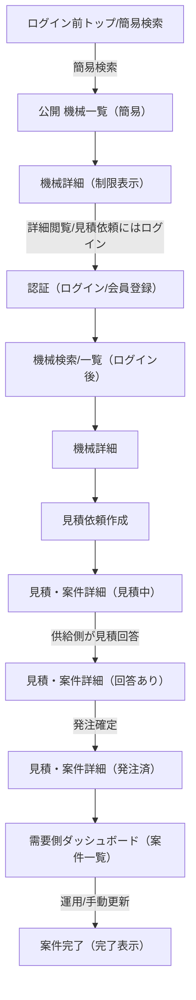
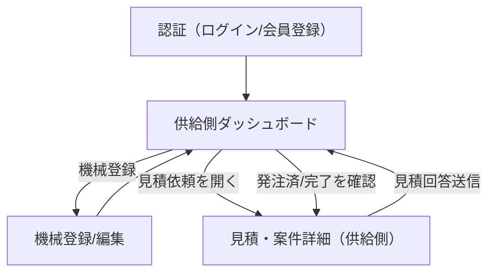
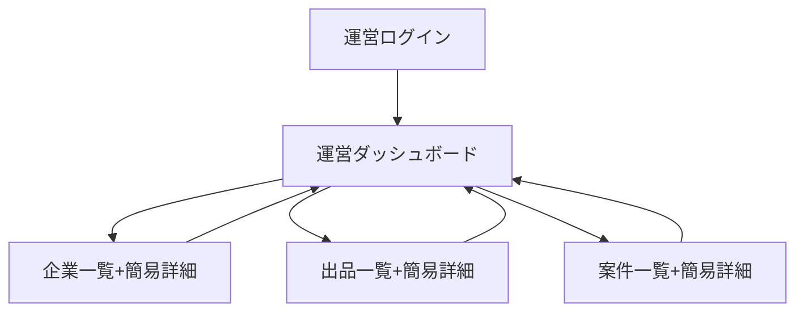

## ユーザーフロー（MVP必須機能のみ）

本ドキュメントは、MVPで実装する最小限の画面遷移を **需要側 / 供給側 / 運営** の3本に整理する。

---

## ① 需要側（借りたい／買いたい）

### フロー図（Mermaid）

### 画面遷移ストーリー（画面名 → できること → 次の遷移）

1. **`ログイン前トップ/簡易検索`**
   - **できること**: サービス概要閲覧、簡易検索（エリア/カテゴリ/提供形態）
   - **次の遷移**: 検索 → `公開 機械一覧（簡易）`
2. **`公開 機械一覧（簡易）`**
   - **できること**: 在庫感/相場感の把握（詳細は制限）
   - **次の遷移**: 機械選択 → `機械詳細（制限表示）`
3. **`機械詳細（制限表示）`**
   - **できること**: 機械の概要（スペック/価格目安/所在地）を限定表示
   - **次の遷移**: 「詳細/見積」→ `認証（ログイン/会員登録）`
4. **`認証（ログイン/会員登録）`**
   - **できること**: 企業登録、ログイン（Supabase Auth）
   - **次の遷移**: ログイン完了 → `機械検索/一覧（ログイン後）`（または直前ページに復帰）
5. **`機械検索/一覧（ログイン後）`**
   - **できること**: 条件検索（エリア/カテゴリ/提供形態/期間）と一覧表示
   - **次の遷移**: 機械選択 → `機械詳細`
6. **`機械詳細`**
   - **できること**: 詳細スペック、提供形態（レンタル/売買）、価格目安を確認
   - **次の遷移**: 「見積依頼」→ `見積依頼作成`
7. **`見積依頼作成`**
   - **できること**: 現場情報・期間・台数・備考を入力し送信
   - **次の遷移**: 送信完了 → `見積・案件詳細（見積中）`
8. **`見積・案件詳細（需要側）`**
   - **できること**: 見積依頼内容＋見積回答（到着後）確認、発注確定
   - **次の遷移**:
     - 回答待ち → 同画面（更新）
     - 発注確定 → 同画面（発注済表示）→ `需要側ダッシュボード（案件一覧）`
9. **`需要側ダッシュボード（案件一覧）`**
   - **できること**: 見積中/発注済/完了の案件一覧確認
   - **次の遷移**: 案件選択 → `見積・案件詳細（需要側）`

---

## ② 供給側（貸したい／売りたい）

### フロー図（Mermaid）

### 画面遷移ストーリー（画面名 → できること → 次の遷移）

1. **`認証（ログイン/会員登録）`**
   - **できること**: 企業登録、ログイン（Supabase Auth）
   - **次の遷移**: ログイン完了 → `供給側ダッシュボード`
2. **`供給側ダッシュボード`**
   - **できること**: 出品一覧、見積/案件一覧（最低限）
   - **次の遷移**:
     - 「機械登録」→ `機械登録/編集`
     - 見積/案件を選択 → `見積・案件詳細（供給側）`
3. **`機械登録/編集`**
   - **できること**: 機械登録、掲載/停止（MVPは登録＋掲載状態の切替まで）
   - **次の遷移**: 保存 → `供給側ダッシュボード`
4. **`見積・案件詳細（供給側）`**
   - **できること**: 見積依頼内容を確認し、見積回答を入力して送信
   - **次の遷移**: 送信 → `供給側ダッシュボード`（一覧に反映）

---

## ③ 運営（最低限）

### フロー図（Mermaid）

### 画面遷移ストーリー（画面名 → できること → 次の遷移）

1. **`運営ログイン`**
   - **できること**: 運営ロールでログイン
   - **次の遷移**: `運営ダッシュボード`
2. **`運営ダッシュボード`**
   - **できること**: 入口（企業/出品/案件へ遷移）
   - **次の遷移**:
     - `企業一覧+簡易詳細`
     - `出品一覧+簡易詳細`
     - `案件一覧+簡易詳細`
3. **`企業一覧+簡易詳細`**
   - **できること**: 企業の有効/無効切替
   - **次の遷移**: ダッシュボードへ戻る
4. **`出品一覧+簡易詳細`**
   - **できること**: 出品の掲載/停止切替
   - **次の遷移**: ダッシュボードへ戻る
5. **`案件一覧+簡易詳細`**
   - **できること**: 案件一覧確認（必要ならステータス手動更新）
   - **次の遷移**: ダッシュボードへ戻る

### 変更履歴

| 更新日 | 更新者 | 変更内容 |
|---|---|---|
| 2025-12-26 | PM（AI） | 新規作成 |

