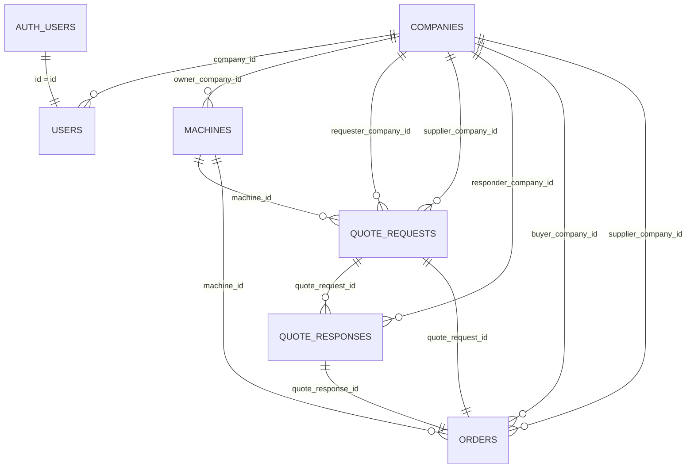

## データモデル（MVP）

本ドキュメントは、MVPで必要な業務データ（会社・ユーザー・機械・見積・案件）を整理する。

### Supabase前提

- **認証**: Supabase Auth（`auth.users`）
- **業務プロフィール**: `public.users`
  - `public.users.id` は `auth.users.id`（UUID）を **PK/FK** として参照
- **業務テーブル**: `public.companies`, `public.machines`, `public.quote_requests`, `public.quote_responses`, `public.orders`
- **認可**: RLS（Row Level Security）を前提（詳細は `06_security_rls.md`）

## ER図（Mermaid）

---

## テーブル一覧（MVP）

### `public.companies`（会社）

- **目的**: B2Bの企業単位を表す
- **主なカラム（最小）**
  - `id` (uuid, PK)
  - `name` (text, required)
  - `company_type` ('DEMAND' | 'SUPPLY' | 'BOTH')
  - `status` ('ACTIVE' | 'INACTIVE')
  - `prefecture` (text, optional)
  - `city` (text, optional)
   - `phone` (text, optional) ※代表電話番号
  - `created_at`, `updated_at`
- **リレーション**
  - 1:N → `public.users`
  - 1:N → `public.machines`
  - 1:N → `public.quote_requests`（requester/supplier）
  - 1:N → `public.quote_responses`（responder）
  - 1:N → `public.orders`（buyer/supplier）

### `public.users`（ユーザープロフィール）

- **目的**: `auth.users` と紐づく業務プロフィール（役割・所属企業）
- **主なカラム（最小）**
  - `id` (uuid, PK/FK → `auth.users.id`)
  - `company_id` (uuid, FK → `public.companies.id`, adminはNULL可)
  - `name` (text, required)
  - `role` ('COMPANY_ADMIN' | 'COMPANY_MEMBER' | 'PLATFORM_ADMIN')
  - `is_active` (boolean)
  - `created_at`, `updated_at`
- **制約（方針）**
  - `PLATFORM_ADMIN` は `company_id is null`
  - 会社ユーザーは `company_id is not null`

### `public.machines`（機械＝出品）

- **目的**: 検索対象となる出品情報
- **主なカラム（最小）**
  - `id` (uuid, PK)
  - `owner_company_id` (uuid, FK → `public.companies.id`)
  - `title` (text, required)
  - `category` (text, required) ※MVPは文字列で可（例: EXCAVATOR/DUMP_TRUCK/ATTACHMENT）
  - `maker` (text, optional)
  - `model` (text, optional)
  - `machine_class` (text, optional) ※0.7等
  - `spec_note` (text, optional)
  - `rental_enabled` (bool)
  - `sale_enabled` (bool)
  - `rental_price_daily` (numeric, optional)
  - `sale_price` (numeric, optional)
  - `location_prefecture` (text, required)
  - `location_city` (text, required)
  - `status` ('DRAFT' | 'PUBLISHED' | 'PAUSED')
  - `created_at`, `updated_at`
- **非対象（MVPでは作らない）**
  - 稼働カレンダー、レビュー、詳細な価格体系（週/月/オペ）

### `public.quote_requests`（見積依頼）

- **目的**: 需要側の依頼情報（現場・期間・台数）
- **主なカラム（最小）**
  - `id` (uuid, PK)
  - `machine_id` (uuid, FK → `public.machines.id`)
  - `requester_company_id` (uuid, FK → `public.companies.id`)
  - `supplier_company_id` (uuid, FK → `public.companies.id`) ※`machines.owner_company_id` のスナップショット
  - `transaction_type` ('RENTAL' | 'SALE')
  - `site_name` (text, optional)
  - `site_address` (text, required)
  - `start_date` (date, required) ※売買の場合は引渡希望日として扱ってもよい
  - `end_date` (date, optional) ※売買は任意
  - `quantity` (int, required)
  - `delivery_date` (date, optional)
  - `pickup_date` (date, optional)
  - `note` (text, optional)
  - `status` ('PENDING' | 'RESPONDED' | 'ORDERED' | 'CANCELLED')
  - `created_at`, `updated_at`
- **補足**
  - MVPのUIは「1機械×1社×1依頼」を基本とするが、DBは `quote_responses` を 1:N で持てる

### `public.quote_responses`（見積回答）

- **目的**: 供給側が返す金額・条件
- **主なカラム（最小）**
  - `id` (uuid, PK)
  - `quote_request_id` (uuid, FK → `public.quote_requests.id`)
  - `responder_company_id` (uuid, FK → `public.companies.id`)
  - `price_base` (numeric, required)
  - `price_transport` (numeric, optional)
  - `price_total` (numeric, required)
  - `currency` (text, default 'JPY')
  - `terms_note` (text, optional)
  - `status` ('SENT' | 'ACCEPTED')
  - `created_at`, `updated_at`

### `public.orders`（案件＝発注後）

- **目的**: 発注確定した取引を追跡する
- **主なカラム（最小）**
  - `id` (uuid, PK)
  - `quote_request_id` (uuid, FK → `public.quote_requests.id`)
  - `quote_response_id` (uuid, FK → `public.quote_responses.id`)
  - `machine_id` (uuid, FK → `public.machines.id`)
  - `buyer_company_id` (uuid, FK → `public.companies.id`)
  - `supplier_company_id` (uuid, FK → `public.companies.id`)
  - `transaction_type` ('RENTAL' | 'SALE')
  - `start_date` (date, required)
  - `end_date` (date, optional)
  - `quantity` (int, required)
  - `agreed_price_total` (numeric, required)
  - `status` ('ORDERED' | 'IN_PROGRESS' | 'COMPLETED' | 'CANCELLED')
  - `created_at`, `updated_at`

---

## ステータス一覧と遷移ルール（簡易）

### `machines.status`

- **DRAFT → PUBLISHED → PAUSED →（再度）PUBLISHED**
- **DRAFT → PAUSED**（任意：実装を簡単にするなら許可）

### `quote_requests.status`

- **PENDING → RESPONDED → ORDERED**
- **PENDING/RESPONDED → CANCELLED**（需要側がキャンセル）
- **ORDERED 以降は戻さない**

### `quote_responses.status`

- **SENT → ACCEPTED**（需要側が発注確定した時点で採用）

### `orders.status`

- **ORDERED → IN_PROGRESS → COMPLETED**
- **ORDERED/IN_PROGRESS → CANCELLED**（運用上の中止）

### 変更履歴

| 更新日 | 更新者 | 変更内容 |
|---|---|---|
| 2025-12-26 | PM（AI） | 新規作成 |

